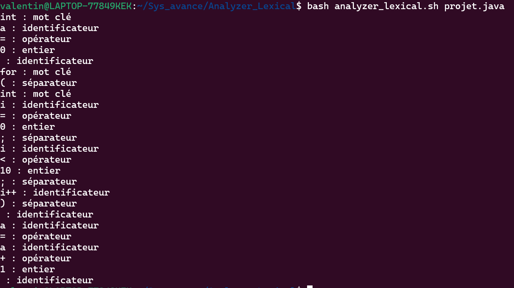

# Analyseur-Lexical


## Description

Ce script est un analyseur lexical basique qui prend en entrée un fichier source (Java, C, C++, Python, etc.)

## Utilisation

```bash
./analyseur-lexical.sh <fichier_source>
```

## Exemple

```bash
./analyseur-lexical.sh projet.java
```


